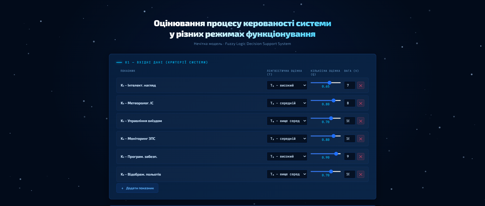

# 🔷 fuzzy-controllability-assessment

> Програма підтримки прийняття рішень для оцінювання рівня керованості процесів у складних системах з урахуванням різних режимів функціонування на основі нечіткої логіки.

---

## 📌 Опис

Веб-застосунок реалізує **нечітку модель оцінювання керованості системи** згідно з методикою Лабораторної роботи №4. Програма дозволяє:

- вводити лінгвістичні та кількісні оцінки показників системи
- автоматично виконувати фазифікацію, агрегування та дефазифікацію
- обирати сценарій розгортання подій (M₁–M₄)
- отримувати оцінку керованості для **8 режимів функціонування** (C₁–C₈)
- визначати безпечний / небезпечний стан системи відносно порогу α

---



## 🚀 Запуск

Просто відкрийте файл у браузері — жодних залежностей або сервера не потрібно:

```bash
# Клонувати репозиторій
git clone https://github.com/YOUR_USERNAME/fuzzy-controllability-assessment.git

cd fuzzy-controllability-assessment

# Відкрити в браузері
open index.html
# або просто двічі клікніть на index.html
```

---

## 🧮 Математична модель

Реалізовані формули відповідно до методики:

| Формула                          | Опис                                     |
| -------------------------------- | ---------------------------------------- |
| `O_i = a_term × q_i`             | Критеріальна оцінка (фаз. (2))           |
| `μ(O_i)` — S-подібна             | Функція належності (форм. (3))           |
| `w_i = v_i / Σv_i`               | Нормовані вагові коефіцієнти (форм. (4)) |
| `M₁` – гармонічна                | Песимістичний сценарій (форм. (5))       |
| `M₂` – геометрична               | Обережний сценарій (форм. (6))           |
| `M₃` – зважена сума              | Середній сценарій (форм. (7))            |
| `M₄` – зважена СКВ               | Оптимістичний сценарій (форм. (8))       |
| `R_g = M_g × (b−a) + a`          | Тренд рівня керованості (форм. (9))      |
| `μ_C(R_g) = 1 − ((R−a)/(b−a))^k` | Оцінка за режимом (форм. (10))           |

### Режими функціонування та пороги k

| Режим                  | Позначення | k   |
| ---------------------- | ---------- | --- |
| Штатний                | C₁         | 2   |
| Позаштатний            | C₂         | 7/4 |
| Критична ситуація      | C₃         | 3/2 |
| Надзвичайна ситуація   | C₄         | 5/4 |
| Аварійна ситуація      | C₅         | 3/4 |
| Аварія                 | C₆         | 1/2 |
| Катастрофічна ситуація | C₇         | 1/4 |
| Катастрофа             | C₈         | 1/8 |

---

## 🖥️ Інтерфейс

- **Темно-синя тема** з анімованим снігом на фоні
- **Динамічна таблиця** критеріїв — можна додавати та видаляти рядки
- **Слайдери** для введення кількісних оцінок q ∈ [0; 1]
- **Покрокові обчислення** — повний лог усіх проміжних значень
- **Бар-чарт** рівня керованості по всіх 8 режимах
- **Субординація** M₁ ≤ M₂ ≤ M₃ ≤ M₄ відображається автоматично

---

## 📁 Структура

```
fuzzy-controllability-assessment/
└── index.html      # Вся програма — один файл, без залежностей
└── README.md
```

---

## 🎓 Навчальний контекст

**Лабораторна робота №4** — _Програмна технологія оцінювання процесу керованості системи у різних режимах функціонування_

Приклад із роботи: оцінювання рівня захищеності **інформаційних систем менеджменту аеропорту** при загрозах безпеки даних за 6 показниками (K₁–K₆).

---

## 🛠️ Технології

- Vanilla JavaScript (ES6+)
- HTML5 Canvas (анімація снігу)
- CSS3 (змінні, градієнти, анімації)
- Google Fonts: Exo 2, JetBrains Mono
- Без фреймворків, без залежностей

---

## 📄 Ліцензія

MIT
